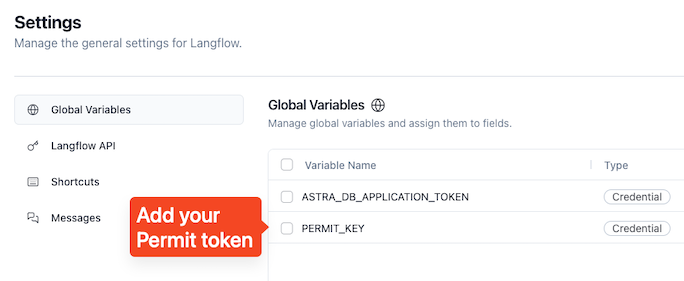

# permit-langflow-filter

## AstraDB instructions:
1. Create a database
2. Create Vector-enabled collection with Mistral Embeddings
3. Leave the collection empty

## LangFlow instructions:
1. Create a new blank project
2. Create a confidential Global Variable in Settings for Permit Key
    
    

3. Import `flows.json` into LangFlow
    - you should be ok with importing this JSON only
    - other `*.py` files are added for reference as they are custom components implemented for this project
4. Add Mistral API key
    1. Create a free Mistral account
    2. Get your API key from https://console.mistral.ai/api-keys/
    3. Add the key to Mistral components
5. Run ingestion flow:
    1. Select the AstraDB database and collection
    2. Click Play button
    3. Check if the collection is populated with vectors
6. Install Permit with `pip install` component
    - make sure the installation succeeds by verifing output `Installation status`
7. Run the chat flow by either:
    1. Opening the Playground (bottom right corner)
    2. Clicking the Play icon button on the **last** component